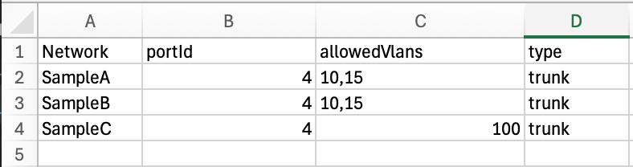
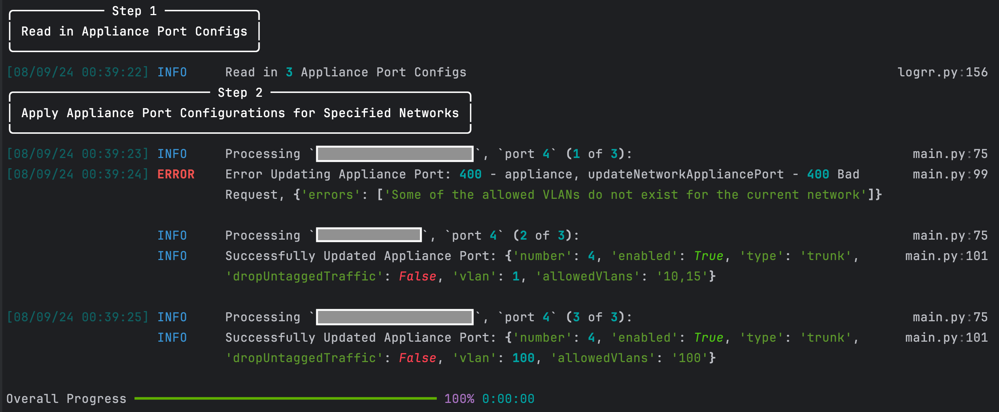
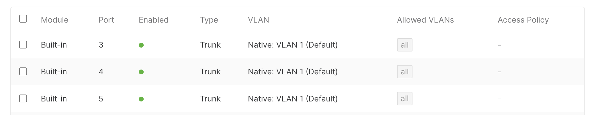
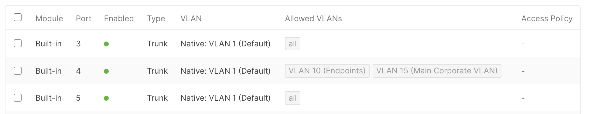

# Meraki Bulk Appliance Per Port VLAN Configuration

This script configures Meraki Appliance Network Per Port VLAN settings in bulk. The provided example focuses on allowing explicit VLANs per port.

Configurations are provided via a CSV file.

## Contacts
* Trevor Maco

## Solution Components
* Meraki

## Prerequisites
#### Meraki API Keys
In order to use the Meraki API, you need to enable the API for your organization first. After enabling API access, you can generate an API key. Follow these instructions to enable API access and generate an API key:
1. Login to the Meraki dashboard
2. In the left-hand menu, navigate to `Organization > Settings > Dashboard API access`
3. Click on `Enable access to the Cisco Meraki Dashboard API`
4. Go to `My Profile > API access`
5. Under API access, click on `Generate API key`
6. Save the API key in a safe place. The API key will only be shown once for security purposes, so it is very important to take note of the key then. In case you lose the key, then you have to revoke the key and a generate a new key. Moreover, there is a limit of only two API keys per profile.

> For more information on how to generate an API key, please click [here](https://developer.cisco.com/meraki/api-v1/#!authorization/authorization). 

> Note: You can add your account as Full Organization Admin to your organizations by following the instructions [here](https://documentation.meraki.com/General_Administration/Managing_Dashboard_Access/Managing_Dashboard_Administrators_and_Permissions).

## CSV Files
1 input CSV File is required (must be in the `src` folder!). By default `mx_allowed_vlans_sample.csv` is selected (configured in `src` > `config` > `settings.py`). A CSV file can also be provided via CLI arguments (see `Usage` section).

The CSV file **MUST** include the `Network Name` and `portId` columns. All additional CSV Column Headers come from the Meraki [API Call](https://developer.cisco.com/meraki/api-v1/update-network-appliance-port/). The column header names must match the API field names exactly and follow the rules specified in the documentation (they are passed as is into the API).

**Note**: The included example file shows configuring explicit Allowed VLANs on port 4 for various networks.



## Installation/Configuration
1. Clone this repository with `git clone [repository name]`. To find the repository name, click the green `Code` button above the repository files. Then, the dropdown menu will show the https domain name. Click the copy button to the right of the domain name to get the value to replace [repository name] placeholder.
2. Rename the `.env_sample` file to `.env`. Rename `settings_example.py` to `settings.py` (in `src/config` directory).
3. Add `Meraki API key` and `Org ID` (found at the bottom of a Meraki Org Webpage) to `.env`
```dotenv
MERAKI_API_KEY="API key goes here"
ORG_ID="Org ID goes here"
```
4. (Optional) Specify the name of the input CSV file in `settings.py` (`src/config`) if not using the default file.
```python
# Optional CSV File Name
CSV_FILE_NAME = "mx_allowed_vlans_sample.csv"
```
5. Set up a Python virtual environment. Make sure Python 3 is installed in your environment, and if not, you may download Python [here](https://www.python.org/downloads/). Once Python 3 is installed in your environment, you can activate the virtual environment with the instructions found [here](https://docs.python.org/3/tutorial/venv.html).
6. Install the requirements with `pip3 install -r requirements.txt`

## Usage

To run the program, use the command (in the `src` folder):
```shell
$ python3 main.py
```

To specify the input configuration file, use the `-i` or `--input` flag (again, the file MUST be located in the `src` directory):
```shell
$ python3 main.py -i mx_allowed_vlans_sample.csv
```

The script will apply the per port configurations for the various networks.



* Before:


* After:


**Note**: Logs from each run can be found in the `logs` folder

### LICENSE

Provided under Cisco Sample Code License, for details see [LICENSE](LICENSE.md)

### CODE_OF_CONDUCT

Our code of conduct is available [here](CODE_OF_CONDUCT.md)

### CONTRIBUTING

See our contributing guidelines [here](CONTRIBUTING.md)

#### DISCLAIMER:
<b>Please note:</b> This script is meant for demo purposes only. All tools/ scripts in this repo are released for use "AS IS" without any warranties of any kind, including, but not limited to their installation, use, or performance. Any use of these scripts and tools is at your own risk. There is no guarantee that they have been through thorough testing in a comparable environment and we are not responsible for any damage or data loss incurred with their use.
You are responsible for reviewing and testing any scripts you run thoroughly before use in any non-testing environment.